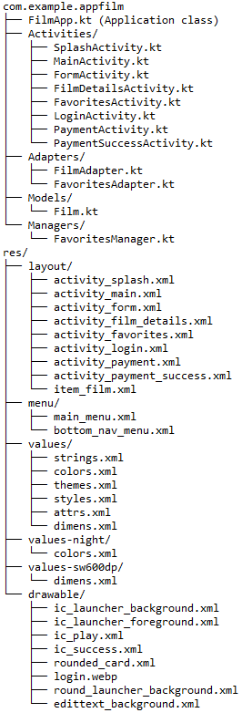
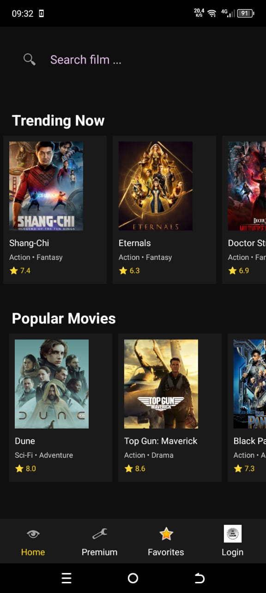
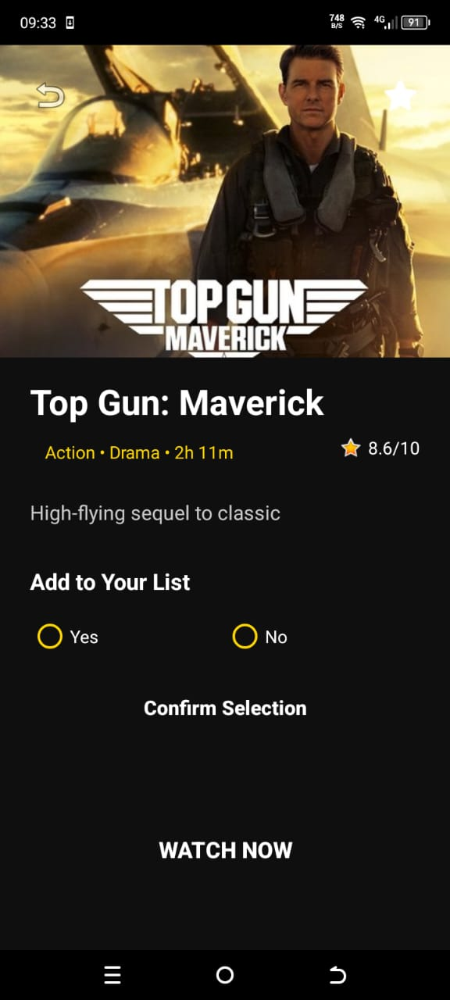
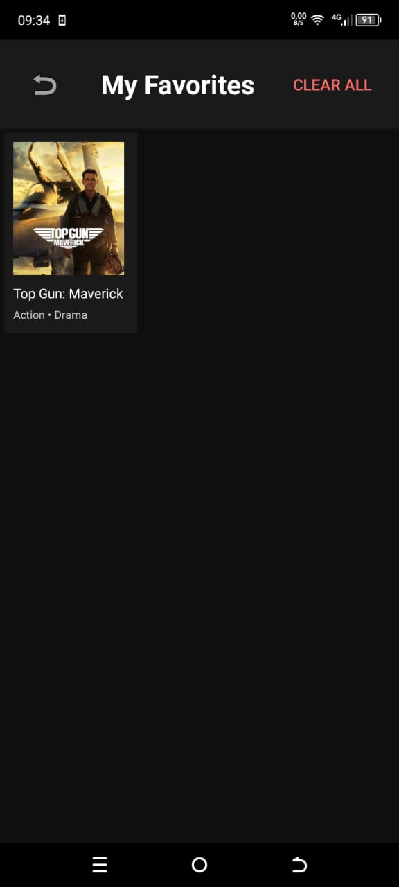
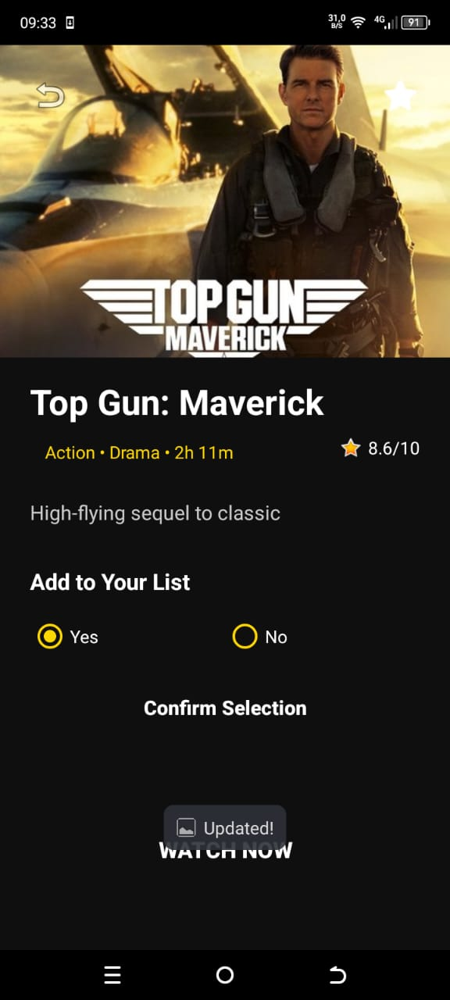
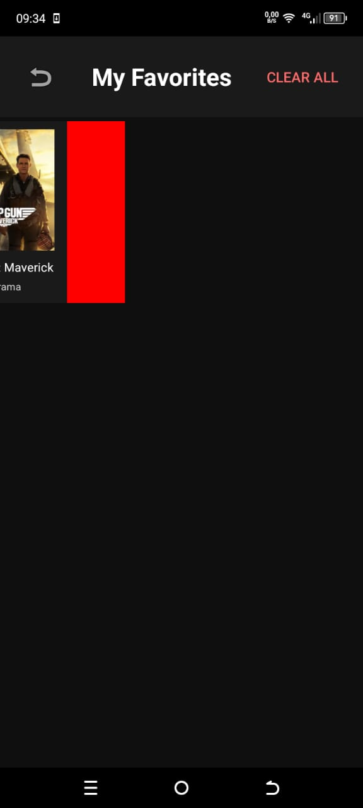
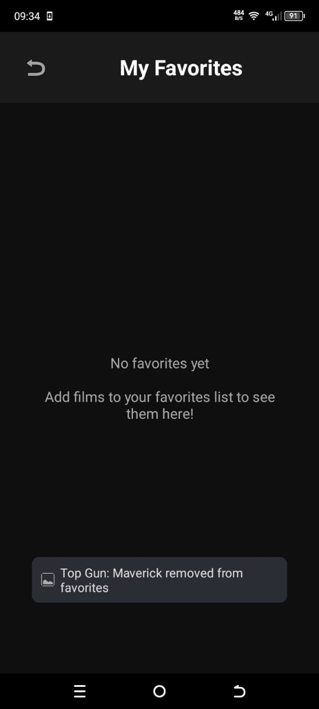
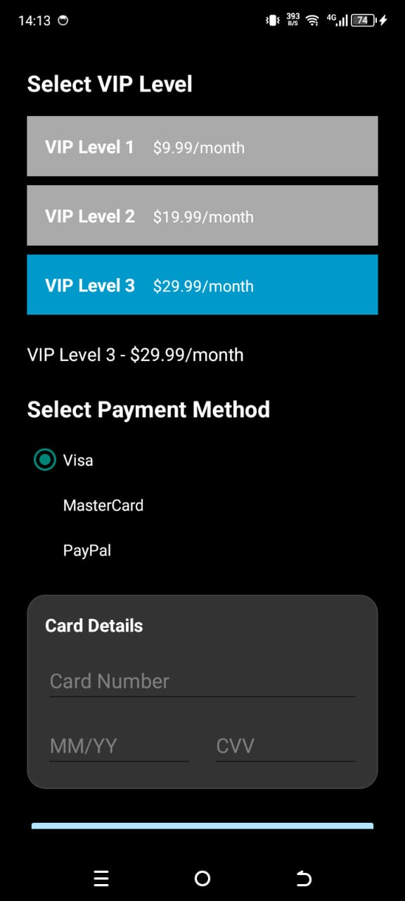
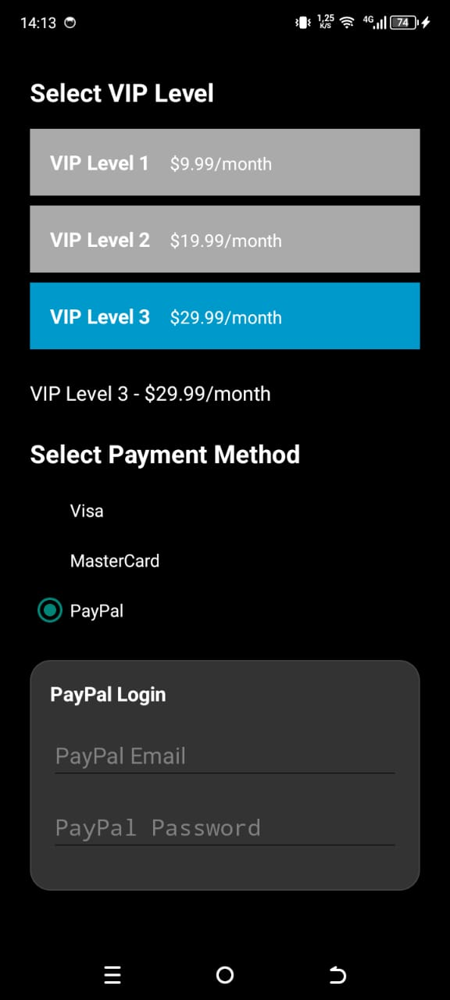

# 🎬 Application Film - Application de Streaming de Films

Une application Android moderne de streaming de films développée en Kotlin qui permet aux utilisateurs de parcourir des films, gérer leurs favoris et souscrire à des abonnements VIP premium.


## 📋 Table des Matières
- [Fonctionnalités](#-fonctionnalités)
- [Architecture](#-architecture)
- [Captures d'Écran](#-captures-décran)
- [Stack Technique](#-stack-technique)
- [Installation](#-installation)
- [Structure du Projet](#-structure-du-projet)

## 🎯 Fonctionnalités

### ✨ Fonctionnalités Principales
- **🎬 Navigation des Films** - Parcourir les films across multiples catégories (Tendances, Populaires, Nouvelles Sorties, Action, Comédie)
- **📖 Détails des Films** - Vue détaillée avec descriptions, notations et métadonnées
- **⭐ Gestion des Favoris** - Ajouter/supprimer des films aux favoris personnels avec glisser-supprimer
- **🔐 Authentification Utilisateur** - Système de connexion simple
- **💎 Abonnement VIP** - Abonnement premium à trois niveaux avec flux de paiement sécurisé

### 🎨 Expérience Utilisateur
- **🌙 Thème Sombre** - Belle interface sombre avec accents dorés
- **↔️ Défilement Horizontal** - Navigation fluide par catégories
- **🖼️ Chargement d'Images** - Chargement rapide d'images avec Picasso
- **📱 Design Responsive** - Optimisé pour différentes tailles d'écran
- **💫 Gestes de Glissement** - Glisser-supprimer intuitif dans les favoris

### 💳 Système de Paiement
- **🏆 Niveaux VIP** :
    - **Niveau 1** : 9,99€/mois - Fonctionnalités de base
    - **Niveau 2** : 19,99€/mois - Fonctionnalités premium
    - **Niveau 3** : 29,99€/mois - Fonctionnalités ultimes
- **💳 Méthodes de Paiement** - Support Visa, MasterCard, PayPal
- **🔒 Validation Sécurisée** - Validation complète des entrées

## 🏗️ Architecture

<div align="center">


*Diagramme d'architecture montrant la structure complète de l'application*

</div>

## 📸 Captures d'Écran

### 📱 Interface Utilisateur

<div align="center">

| Écran d'Accueil | Détails du Film |                    Liste des Favoris                    |
|:---------------:|:---------------:|:-------------------------------------------------------:|
|  |  |  |
| *Interface principale avec navigation par catégories* | *Détails complets du film avec notation* |              *Interface des Films Favoris*              |

| Processus de Paiement | Confirmation | Authentification |
|:---------------------:|:------------:|:----------------:|
|  |  |  |
| *Sélection d'abonnement VIP* | *Paiement réussi* | *Connexion utilisateur* |

</div>

### 🔍 Vues Supplémentaires

<div align="center">

|              Détails Film et ajout aux Favoris               |               Favoris + Swipe(Suppression)               |           Favoris apres Suprresion des Films             |
|:------------------------------------------------------------:|:--------------------------------------------------------:|:--------------------------------------------------------:|
|  |  |  |
|                     *Ajout aux favoris*                      |          *Gestion des films favoris avec swipe*          |                    *Gestion avancée*                     |

|                         Paiement VISA                         |                      Paiement MASTERCARD                      |                        Paiement PAYPAL                        |
|:-------------------------------------------------------------:|:-------------------------------------------------------------:|:-------------------------------------------------------------:|
|  |  |  |
|                     *Champs a remplir*                     |                      *Champs a remplir*                       |                        *Finalisation*                         |

</div>

### 📚 Documentation Technique

<div align="center">


*Documentation technique générée par Dokka - Structure complète du code avec commentaires KDoc*

</div>

## 🛠️ Stack Technique

### 🔧 Technologies Utilisées
- **📝 Langage** : Kotlin
- **📱 SDK Minimum** : 24 (Android 7.0)
- **🎯 SDK Cible** : 36
- **🏗️ Architecture** : Pattern MVC
- **🖼️ Chargement d'Images** : Picasso
- **📐 Layout** : ConstraintLayout + LinearLayout
- **📋 Listes** : RecyclerView avec adaptateurs personnalisés
- **💾 Stockage** : SharedPreferences pour les favoris
- **🌐 Réseau** : Permission Internet pour le chargement d'images

### 📦 Dépendances

```kotlin
dependencies {
    implementation("com.google.code.gson:gson:2.10.1")
    implementation("com.squareup.picasso:picasso:2.71828")
    implementation("androidx.recyclerview:recyclerview:1.3.2")
    implementation(libs.androidx.core.ktx)
    implementation(libs.androidx.appcompat)
    implementation(libs.material)
    implementation(libs.androidx.activity)
    implementation(libs.androidx.constraintlayout)
    testImplementation(libs.junit)
    androidTestImplementation(libs.androidx.junit)
    androidTestImplementation(libs.androidx.espresso.core)
}
```
## 🔧 Installation

1. **Cloner le dépôt**
   ```bash
   git clone https://github.com/StailiSaad/AppFilm
 
